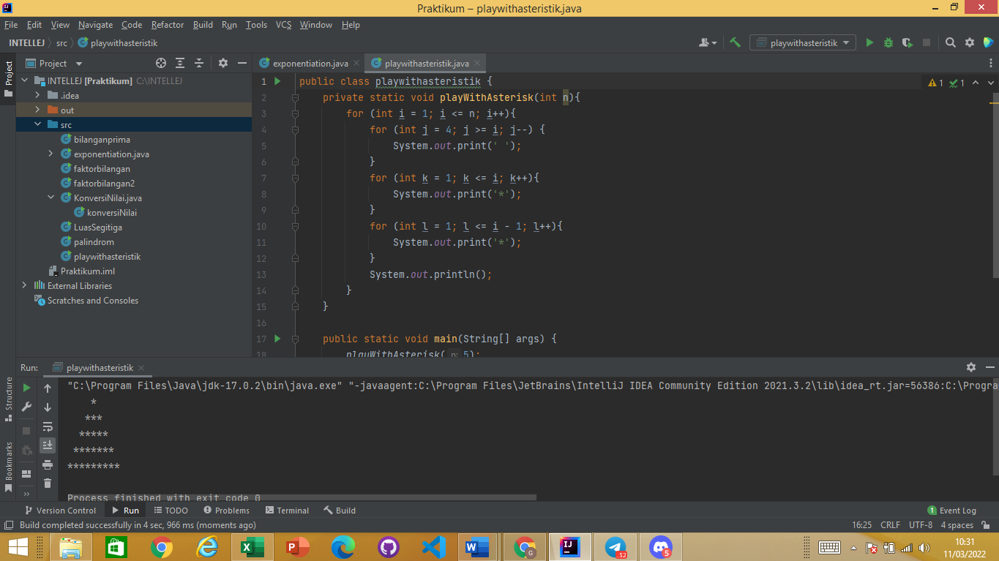

# INTRODUCTION BASIC PROGRAMMING
  Materi yang akan dibahas :
  1. Penjelasan Java
  2. Alasan Menggunakan Java
  3. Tools yang digunakan
  4. Basic - Basic Programming

## Java 
   - Java merupakan salah satu bahasa populer saat ini. Java diciptakan oleh James Gosling tahun 1995 yang pada saat itu masih bekerja di Sun Microsystem. Sesuai penuturan penciptanya, Java adalah bahasa yang general purposed, class-based, object-oriented, dan concurrent.

   - Java merupakan bahasa bahasa pemrograman tingkat tinggi yang berorientasi pada object dan program java tersusun dari bagian yang disebut dengan (Class). Class terdiri dari metode - metode yang melakukan pekerjaan dan mengembalikan informasi setelah melakukan tugasnya. Para programmer Java banyak mengambil keuntungan dari kumpulan class di pustaka class Java yang disebut dengan Java Application Programming Interface (API). Class - class ini dikelompokkan menjadi sekelompok yang disebut dengan paket (package). Java API telah menciptakan applet dan aplikasi canggih dengan menyediakan fungsionalitas yang memadai .

   - terdapat dua hal yang harus dipelajari dalam Java, yaitu :
     1. bagaimana menggunakan class pada Java API
     2. Mempelajari bahasa Java
    Tidak ada cara lain selain class yang merupakan satu-satunya cara menyatakan bagian eksekusi program. Pada Java program javac untuk mengkompilasi file kode sumber Java menjadi class-class bytecode. File kode sumber mempunyai ekstensi *.java. Kompilator javac menghasilkan file bytecode class dengan ekstensi *.class. Interpreter adalah modul utama pada sistem Java yang digunakan aplikasi Java dan menjalankan program bytecode Java.

   - Dengan kata lain Java adalah bahasa pemrograman yang dapat membuat seluruh bentuk aplikasi tidak hanya desktop dan web namun juga bisa membuat aplikasi mobile dan lainnya, sebagaimana dibuat dengan menggunakan bahasa pemrograman konvensional yang lain. Java merupakan bahasa pemrograman yang bersifat umum atau non-spesifik (general purpose). Bahasa Pemrograman Java berorientasi object (OOP-Object Oriented Programming), dan dapat dijalankan pada berbagai platform sistem operasi. Pada OOP, program komputer sebagai kelompok object yang saling berinteraksi.

## Alasan menggunakan java
   1. Bahasa yang digunakan sederhana
      Jika dibandingkan dengan bahasa pemrograman yang lain, Java bisa di bilang lebih sederhana di banding yang lainnya. Hal ini karena Java menggunakan sintaks yang bisa dibilang mirip dengan C++.

   2. Hanya fokus pada Objek
      Bahasa pemrograman Java hanya fokus pada Objek . Dengan hanya fokus pada objek, program komputer dapat saling berkomunikasi dalam satu kelompok objek.

   3. Pengamanan yang cukup ketat
      Pengamanan pada Java ada tiga lapis. Pengamanan ini tentu saja dilakukan untuk melindungi sistem dari penyalahgunaan orang-orang yang tidak bertanggung jawab.

   4. Dapat di pakai pada sistem operasi manapun
      Seperti yang sudah di dijelaskan pada point 1  jika Java dapat berjalan pada komputer yang menggunakan sistem operasi apapun. Hal ini dapat dilakukan karena Bahasa Java termasuk Platform Independence. Ketika dibuat sebuah file, maka file tersebut bisa dijalankan pada perangkat manapun.

   5. Menggunakan sistem exception-handling
      Exception-handling ini menyediakan cara untuk memisahkan antara bagian pengamanan kesalahan dan bagian kode normal. Dengan begitu kode tersebut dituntun ke strukstur kode program yang jauh lebih bersih. Jika kesalahan ditemukan, maka Java akan membuat exception. Exception ini dapat ditangkap serta dikelola oleh program tanpa memberikan dampak yang lebih buruk.

   6. Mendukung Native method
      Java mendukung native method atau sebuah fungsi yang ditulis di bahasa lain, khususnya C dan C++. Dengan adanya dukungan secara native method ini memungkinkan programer menulis berbagai fungsi yang bisa dilakukan dengan cepat jika dibandingkan fungsi yang lain.

   7. Terdapat Garbage Collector
      Fungsi dari garbage collector ini mampu mengumpulkan “sampah” secara otomatis. Dengan adanya garbage collector ini programmer tidak perlu dibebani dengan adanya memori yang rusak.

   8. Daftar perpustakaan yang lengkap
      Bahasa pemrograman Java mempunyai daftar perpustakaan yang cukup lengkap. Dengan adanya ini programmer dapat membuat suatu aplikasi sesuai dengan apa yang diinginkan.

   9. Adanya Fitur GUI
      GUI atau singkatan dari Grafical User Interface adalah salah satu fitur yang ada di dalam Java.

  10. Penyempurna dari C++
      Bagi kamu programmer yang terbiasa dengan bahasa pemrograman C++, kamu tidak perlu khawatir dengan bahasa pemrograman java. Karena pada Java gayanya sudah disesuaikan dengan C++. Bahkan dengan bahasa pemrograman Java, kamu dapat memperluas kode-kode yang kamu inginkan dibandingkan melalui C++.

## Tools yang digunakan
   1. JDK (Java Development Kit) 
   merupakan tools pendukung yang digunakan developer untuk proses developing, debugging, dan monitoring. Pada JDK terdapat JRE (Java Runtime Environment) untuk mendukung aplikasi java agar bisa dijalankan.

   2. IDE (Integrated Development Environment) 
   merupakan tools yang dapat membantu developer untuk membuat aplikasi. Di dalam IDE (Integrated Development Environment)  terdapat source code editor, build automation tools, dan debugger. 

# Basic - Basic Programming 
  1. Type Data 
     Integer, Float, Double, Boolean, Char, String 
  2. Branching 
     If then , If Then Else , Switch 
  3. Looping = For , While , DoWhile 
  4. Input Output 
     skema Input : Nilai yang dimasukkan Proses : Serangkaian langkah yang dilakukan untuk mengelola input yang diberikan Output : Menampilkan hasil olah data 
  5. Operator 
     Assignment , Arithmetic , Unary ,Equality dan Relational, dan Conditional

# TASK
  1. Luas Segitiga
     
  2. Konversi Nilai
     
  3. Faktor Bilangan 
     
  4. Faktor Bilangan II
     
  5. Bilangan Prima
     
  6. Palindrome 
     
  7. Exponentiation
     
  8. Play With Asteristik
     
  9. Draw XYZ
     
  10. Cetak Tabel Perkalian
      
  11. Ubah Huruf
  12. Mean
      
