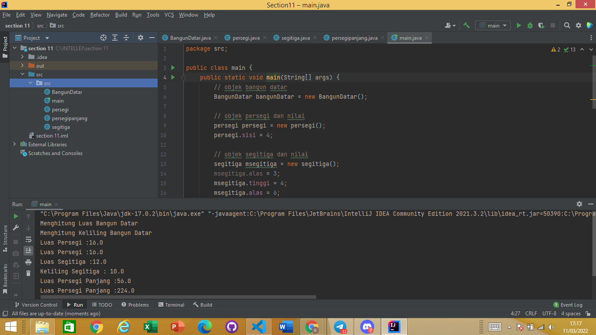
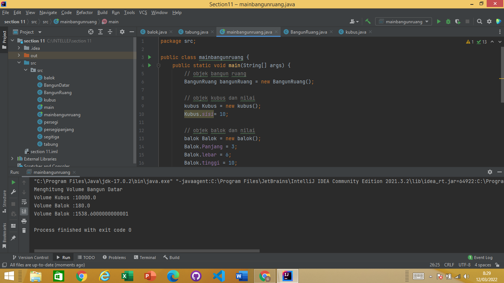
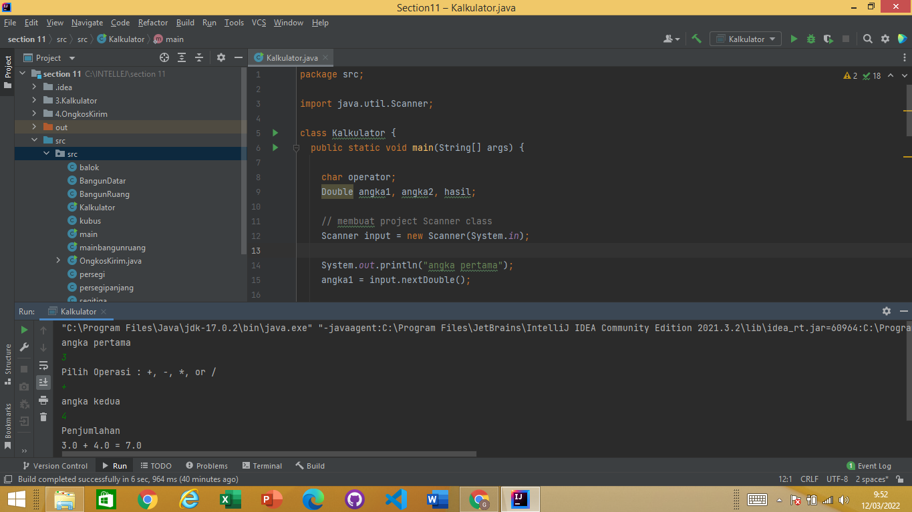
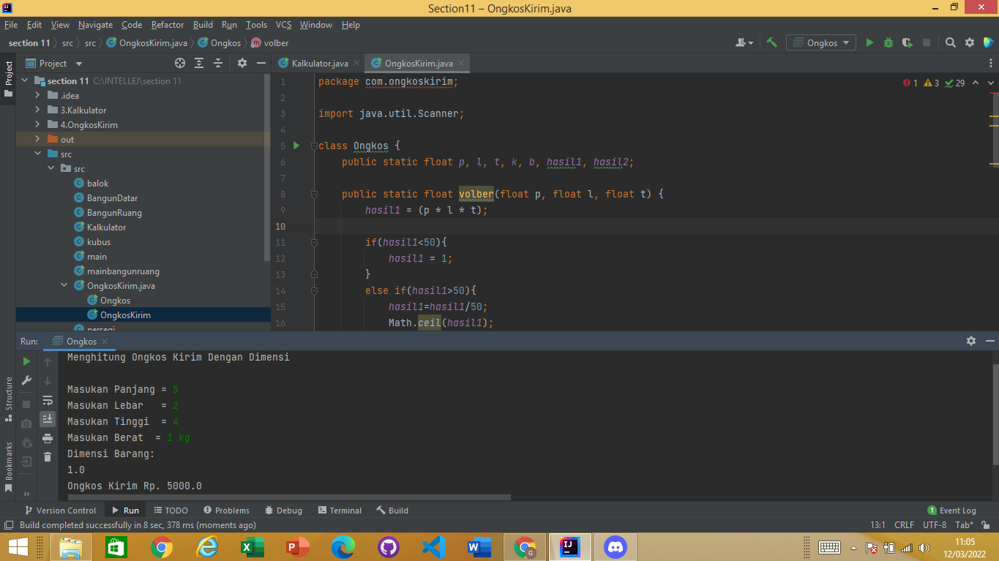

# OBJECT ORIENTED PROGRAMMING
  Materi yang akan dibahas yaitu :
  1. Pemrograman yang berorientasi pada objek
  2. variabel dan fungsi yang berada dalam suatu class.
  3. 2 macam modifier

## Apa itu OOP?
   OOP (Object Oriented Programming) adalah suatu metode pemrograman yang berorientasi kepada objek. Tujuan dari OOP diciptakan adalah untuk mempermudah pengembangan program dengan cara mengikuti model yang telah ada di kehidupan sehari-hari.
## Mengapa menggunakan oop?
   1. mempercepat proses pembuatan aplikasi
   2. Jika program semakin besar/kompleks, kode tersebut sulit untuk dimaintenance menggunakan prosedural.

## komponen oop
   1. class 
      - mengumpulkan prosedur, fungsi dan variabel, dalam satu tempat
      - blueprint dari suatu objek
      - new=> java class=> nama class nya
      - merepresentasikan objek yang akan dibuat
      - penulisan nama class ada aturan (pascal case, diawali huruf kapital, dan jangan menggunakan spasi)
   2. object 
      - variable instant yang merupakan wujud dari class
      - digambarkan dengan variabel dan method
      - berisi beberapa kumpulan variabel dan fungsi yg menggambarkan sebuah objek
   3. attribute 
      - bagian dari class yg masih berhubungan erat dengan class tersebut
      - properties dari sebuah class
      - penggunaan atribut berlaku dari kurung kurawal sampe kurung kurawal akhir, ini dinamakan scope 
      - untuk penulisannya menggunakan lower case, kemudian kata berikutnya kapital., contoh int listCar; int listGetMethod;
   4. method=
      - menjelaskan bagaimana suatu atribut beraksi
      - peran yg dimaksud berupa tingkah laku/behaviour yg digambarkan oleh suatu method
      - misal, ada class manusia, manusia ada tingkah laku seperti berbicara, makan, berjalan dll. 
   5. inheritance 
      - hubungan 2 objek atau lebih
      - terdapat sebuah objek utama yang mewariskan atribut/method yg dimilikinya ke objek lainnya.
      - public class PersegiPanjang extends BangunDatar {}
      - semua member dalam kelas itu dapat diakses oleh subclassnya kecuali dikasih modifier private

## 3 macam modifier
   1. public 
      membuat member dan class dapat di akses dari mana aja. 
   2. private 
      member hanya dapat diakses dalam class itu sendiri.
   3. protected 
      mmember dapat diakses oleh class, dan class lain tapi dalam satu package. jadi tidak bisa dalam package lain

# TASK
1. Menghitung luas dan keliling
   
2. Menghitung volume
   
3. Kalkulator
   
4. Ongkos kirim
   
5. Pewarisan