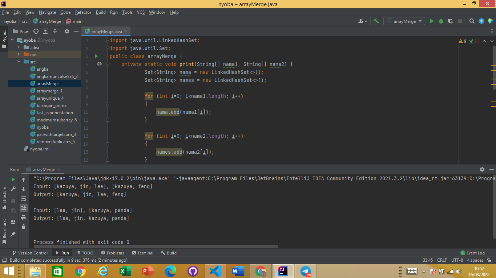
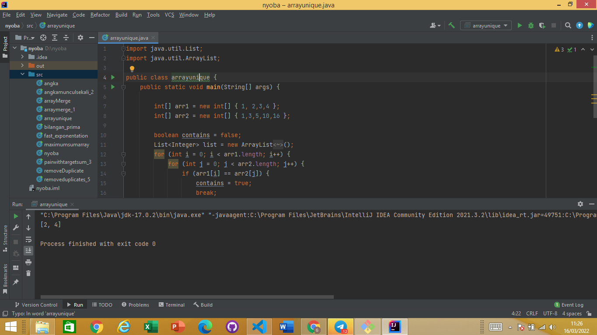
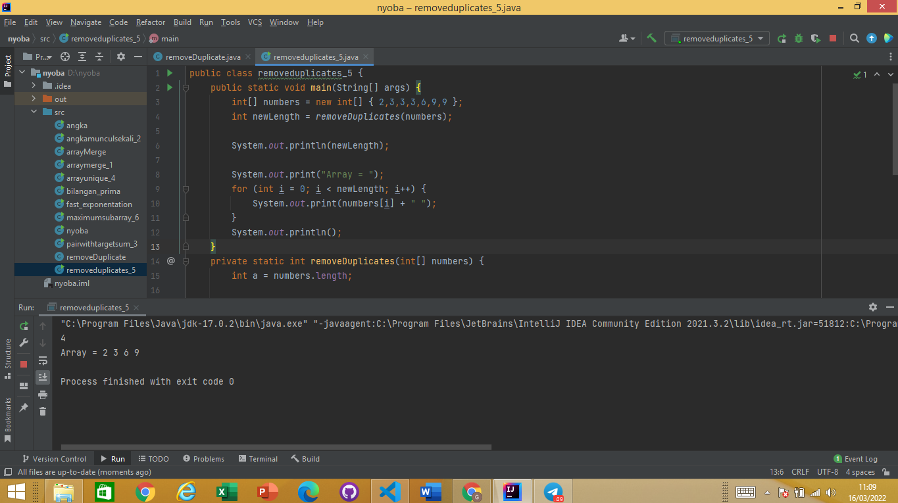
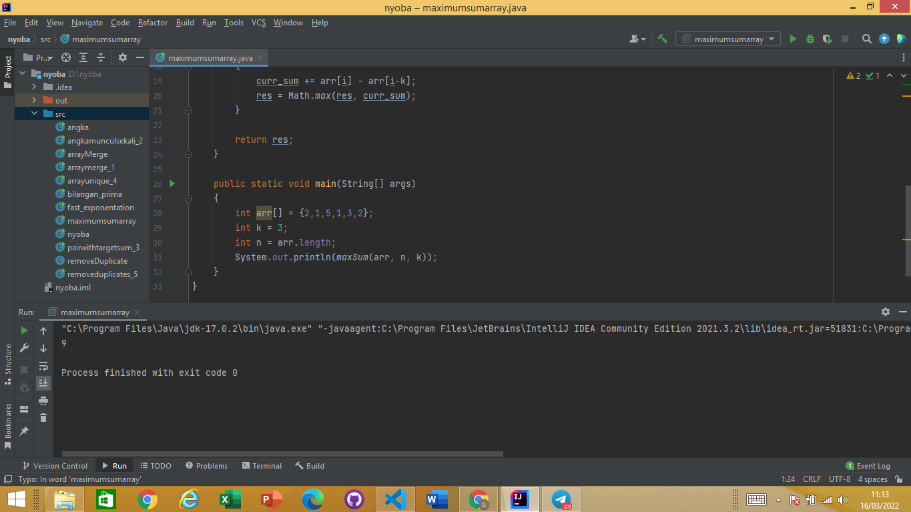

# ITERABLE DATA STRUCTURE
Materi yang akan dibahas : 
1. Apa itu Iterable?
2. Java Iterable Hirarchy Interface
3. Implementasi Iterable

## Apa itu Iterable ?
   Iterable merupakan sekumpulan data atau structure data yang dapat dilakukan literasi atau perulangan pada program. 

## Java Iterable Hirarchy Interface
   Interface Iterable menjadi interface tertinggi dari sructure data lainnya, seperti collection dan list.
   di bawah iterable terdapat colection dan list, dibawah collection terdapat set, sortedset dan navigableset, list, queue, deque,blockingque, blockingdeque dan transferqueue.

   Didalam interface ini merupakan structure data ynag dapat dilakukan perulangan dari masing - masing data.

## Implementasi Iterable
   1. General - Purpose Implementations 
      General - Purpose Implementations are the most commonly used implementations, designed for everyday use. They are summarized in the table titled 
   2. Special-purpose implementations 
      Special-purpose implementations are designed for use in special situations and display nonstandard performance characteristics, usage restrictions, or behavior.
   3. Concurrent implementations 
      Concurrent implementations are designed to support high concurrency, typically at the expense of single-threaded performance. These implementations are part of the java.util.concurrent package.
   4. Wrapper implementations
      Wrapper implementations are used in combination with other types of implementations, often the general-purpose ones, to provide added or restricted functionality.
   5. Convenience implementations 
      Convenience implementations are mini-implementations, typically made available via static factory methods, that provide convenient, efficient alternatives to general-purpose implementations for special collections (for example, singleton sets).
   6. Abstract implementations
      Abstract implementations are skeletal implementations that facilitate the construction of custom implementations — described later in the Custom Collection Implementations section. An advanced topic, it's not particularly difficult, but relatively few people will need to do it.

## Hirarchy Interface
   1. Iterator (metode iterable)
      Merupakan kelas yang dapat mengatur literasi dari sebuah iterable. iterator ini mengelola pada bagian yang sudah dilakukan literasi pada data iterable, juga dapat mengetahui data apa ynag selanjutnya akan diambil, dan bagaimana cara mengambil data tsb.
   2. Collection 
      Merupakan kumpulan dari objek atau data yang diletakkan dalam satu tempat ynag sama dan dikenal sebagai collection of the objects
   3. Java List Implementation
      - Abstarac Collection
      - Abstrac List
      - Array List
      - Abstract sequantial List
      - Linked list
      - Stack 
   4. Set Implementation
      - Comparing set
      - Hash set
      - Linked Hash set
      - Enum set
      - Sorted set
      - Tree set
      - Navigable set
   5. Queue 
      - Queue sortedset
   6. Deque   
      
# TASK
  1. Bilangan Prima
     
  2. Fast Exponentation
     
  3. Array Merge
     
  4. Angka Muncul sekali
     
  5. Pair with target sum
     
  6. Array Unique
      
  7. Remove Duplicates
     
  8. Maximum Sum Subarray
     

