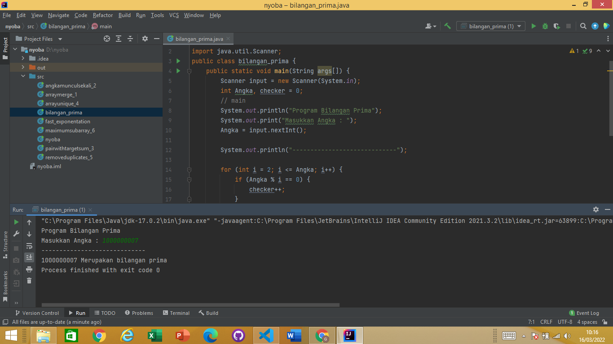
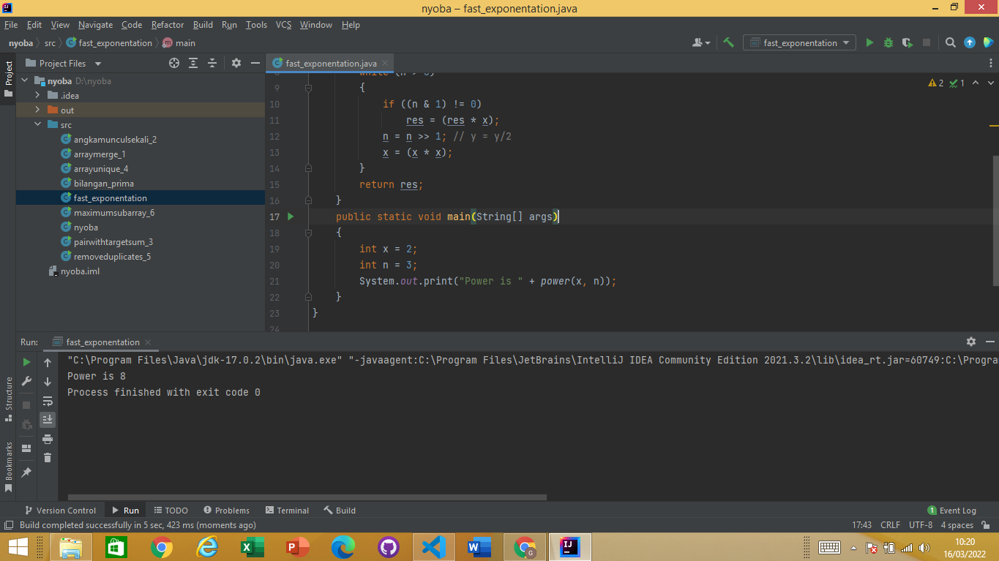
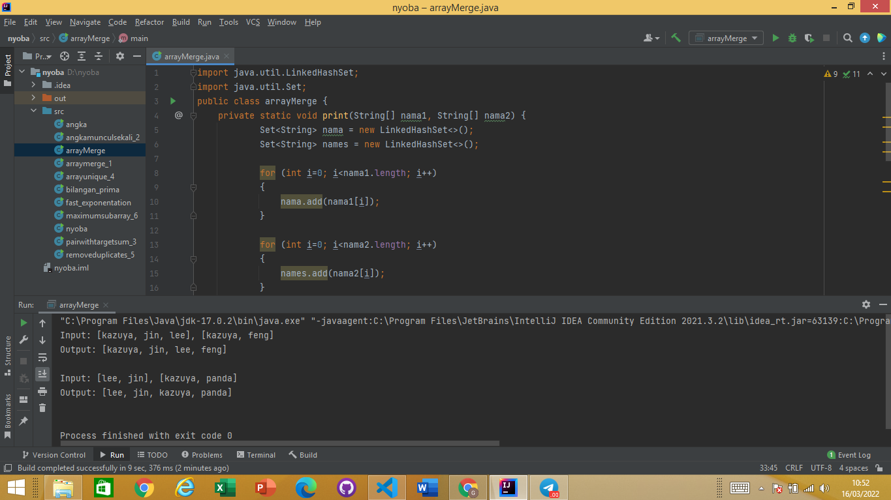
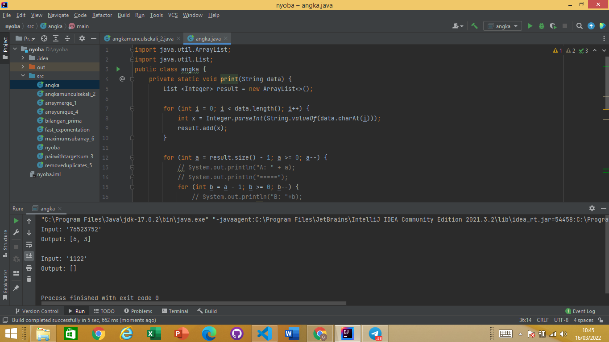
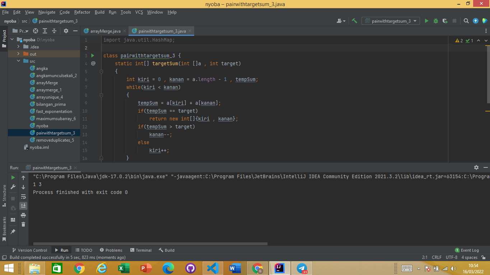
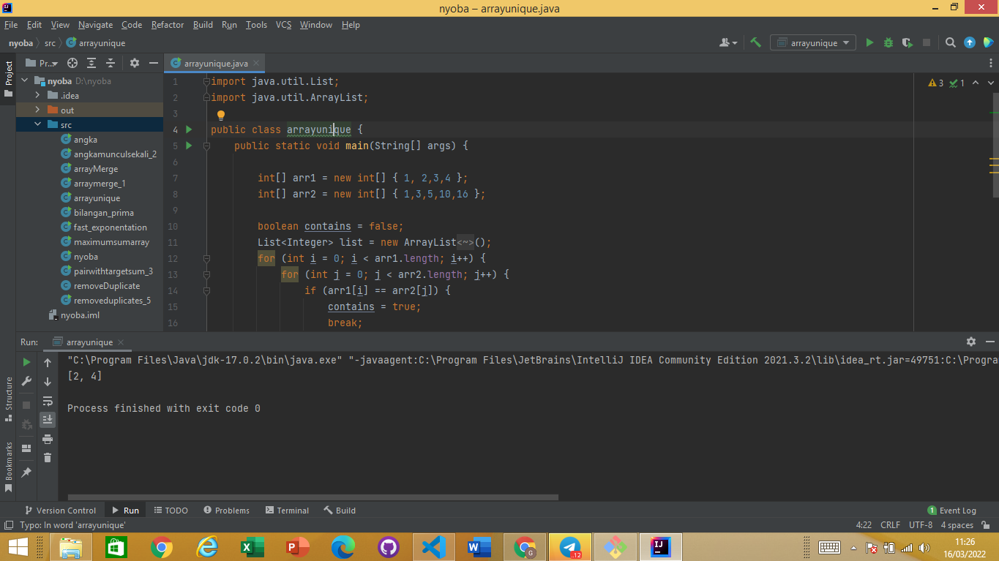
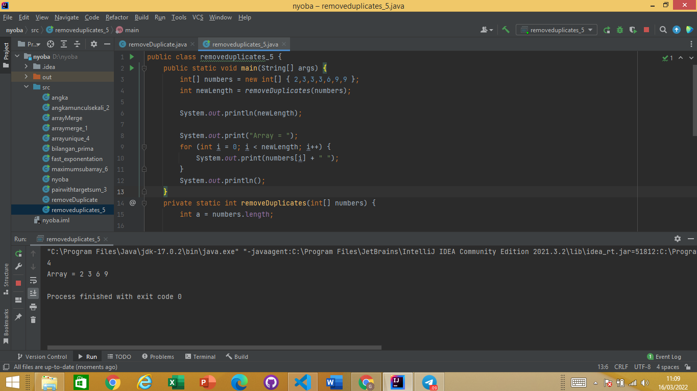
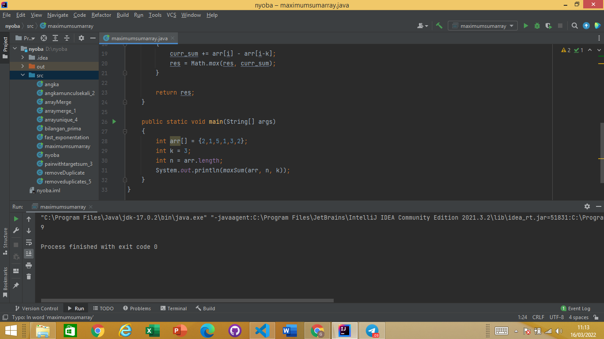

# MAP DATA STRUCTURE
Materi yang dibahas :
1. Apa itu MAP ?
2. Kelas pada MAP

## Apa itu MAP ?
  MAP merupakan struktur data yang ada di java yang dapat digunakan untuk menyimpan banyak data didalamnya. Data didalamnya dapat diidentifikasi menggunakan queue. Setiap queue memiliki data sendiri ynag disebut value. (MAP dapat disebut juga penyimpanan data berbasis Value)

## Implementasi pada MAP
   1. HashMap
      sebuah class yang berisi sekumpulan pasangan nilai (value) dan kunci (key). Nilai bisa dalam bentuk string, integer, boolean, float, double, dan objek. Sedangkan untuk key biasanya dalam bentuk string dan integer.
   2. TreeMap
      implementasi dari class interface yang mengurutkan collection berdasarkan key dari elemen berupa pasangan <key, value>.
   3. LinkedHashMap
      subclass dari HashMap. Itu berarti mewarisi fitur HashMap. Selain itu, linked list mempertahankan penyisipan-order.
   4. Sorted MAP 
      Merupakan map yang dapat diurutkan yang memiliki cara sortir sendiri sendiri. 
   4. Navigable MAP  

# TASK 
  1. Bilangan Prima
     
  2. Fast Exponentation
     
  3. Array Merge
     
  4. Angka Muncul sekali
     
  5. Pair with target sum
     
  6. Array Unique
      
  7. Remove Duplicates
     
  8. Maximum Sum Subarray
     