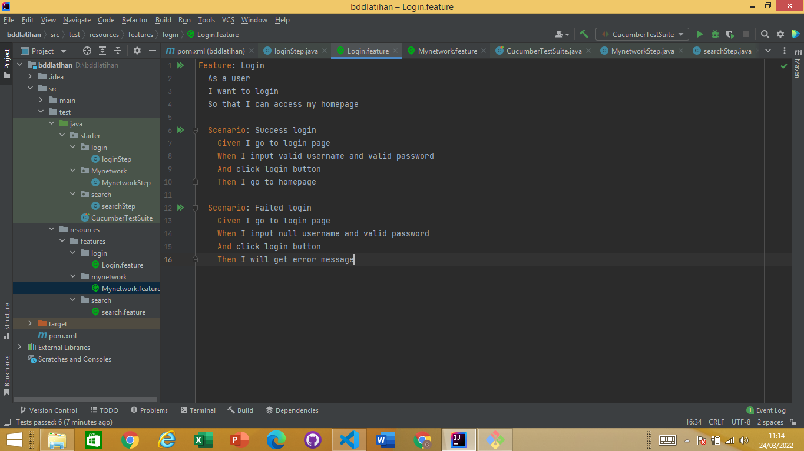
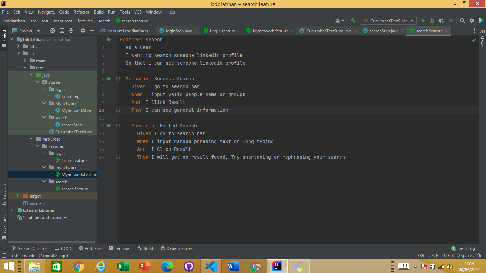
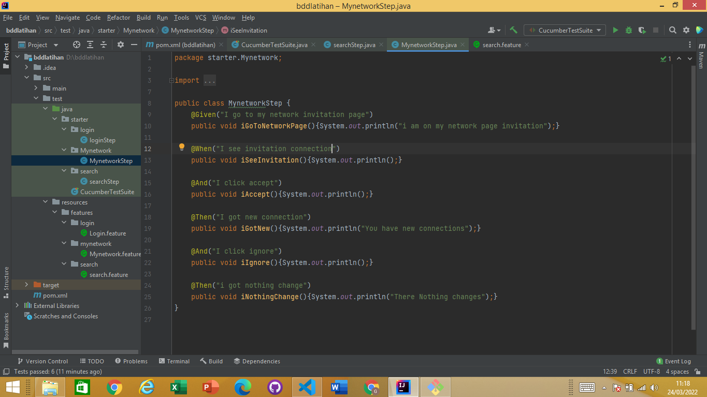
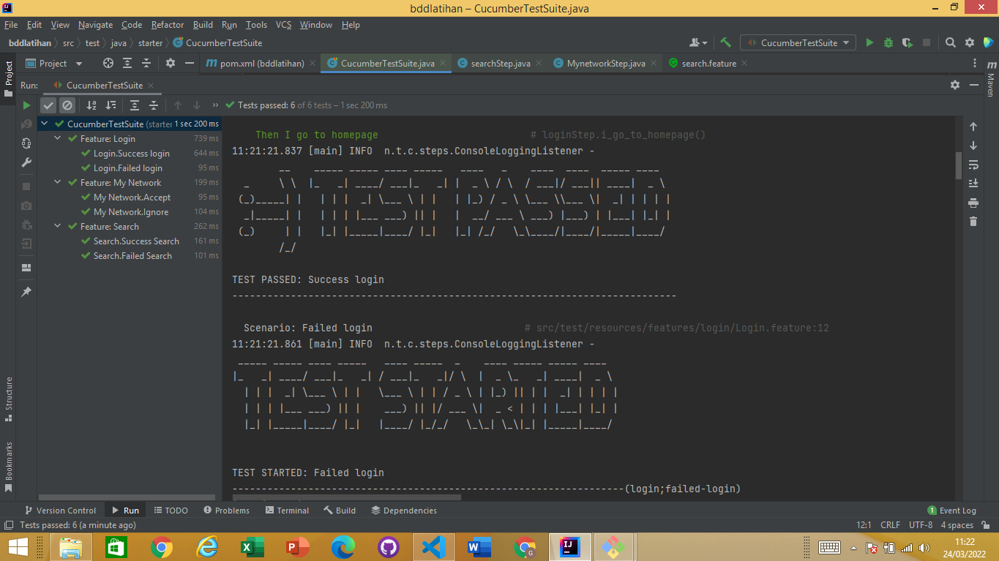
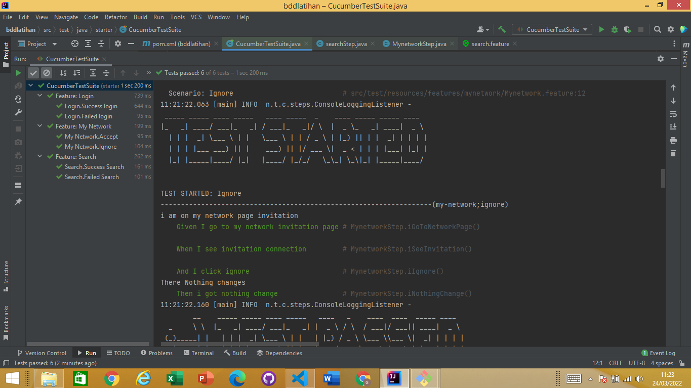

# BEHAVIOUR DRIVEN DEVELOPMENT
  Point materi yang akan dibahas :
  1. Apa itu BDD?
  2. Apa itu Cucumber?

## Apa itu BDD BDD (Behaviour Driven Development)
   TDD (Test Driven Development) merupakan proses software development yang menerapkan penulisan testcase sebelum developer menuliskan production codenya. Proses TDD sendiri berfokus kepada komponen-komponen dalam sistem, dan test cases ditulis dalam bahasa pemograman. Serupa dengan Test-Driven Development (TDD), Behavior-Driven Development (BDD) juga menerapkan konsep test-first, namun dengan fokus yang berbeda. Dalam BDD test, tim pengembang akan menuliskan berbagai skenario yang menjelaskan behavior sistem dari perspektif pengguna. Skenario dituliskan menggunakan format bahasa yang mudah dipahami oleh seluruh stakeholder dalam pengembangan sistem.

   BDD memiliki tujuan utama untuk meningkatkan komunikasi dan kolaborasi antara seluruh stakeholders, tim bisnis, maupun teknikal yang terlibat dalam pengembangan sistem. Hal ini dapat membantu memastikan bahwa Fitur - fitur dalam sistem dapat dipahami dengan baik oleh seluruh anggota tim. Komunikasi yang baik dapat menyatukan persepsi stakeholders yang berbeda-beda dalam suatu pemahaman dan ekspektasi yang sama. Fitur - fitur dalam sistem dapat memenuhi kebutuhan pengguna dan menghasilkan business value.

   ## Prinsip dasar BDD 
      Prinsip dasar dari BDD adalah mendeskripsikan behavior dari sebuah sistem tanpa melibatkan penjelasan implementasinya secara rinci. Terdapat pemisahan antara keduanya.

      Dalam pendekatan BDD, seluruh stakeholders (technical & non-technical) saling berkolaborasi untuk mendeskripsikan kebutuhan pengguna dan kebutuhan fungsional (behavior) sistem, yang dituliskan melalui feature files. Deskripsi yang ada dalam feature files berperan sebagai test logic, yang kemudian akan menjadi dasar bagi Quality Assurance (QA) dalam menuliskan test script untuk implementasi pengujian, dan dasar bagi developer dalam menuliskan implementation code untuk membangun sistem.
      Feature files pada BDD dituliskan menggunakan bahasa Gherkin, dengan format berbahasa Inggris yang mudah dipahami oleh siapa pun — terlepas dari technical knowledge yang dimiliki. Dengan demikian, non-technical stakeholders dapat tetap memahami test logic tanpa perlu memahami implementasi menggunakan kode pemrograman yang lebih kompleks. Begitu pula sebaliknya, technical stakeholders atau developer dapat turut memahami aspek bisnis dari sistem yang mereka implementasikan.

## BDD Format
   Secara mendasar, terdapat tiga tahapan untuk melakukan test dalam BDD : 
   1. Menentukan user stories
      untuk menjelaskan kebutuhan pengguna dan fungsionalitas sistem yang diharapkan
   2. Menuliskan skenario
      dalam feature files, menggunakan Gherkin berdasarkan user stories
   3. Mengimplementasikan test script
      dalam step files berdasarkan skenario
   Contoh :
   User story memiliki format standar yaitu : 
   1. As a <role>
   2. I want to <need/goal>
   3. so that <why>
   Dalam menjelaskan kebutuhan pengguna untuk log in dalam suatu akun, user story yang terbentuk yaitu :
   " As an existing user, I want to log into my account, so that I can see my home page ".
   user story dituliskan dalam skenario. Sebuah feature file terdiri dari satu atau lebih skenario yang menjelaskan apa yang seharusnya dilakukan oleh sistem dalam situasi tertentu. Terdapat 3 keyword sebagai elemen utama dalam skenario BDD: 
   1. Given : menjelaskan konteks dari skenario
   2. When : menjelaskan tindakan yang dilakukan oleh user
   3. Then : menjelaskan outcome dari tindakan yang dilakukan oleh user
   Kita juga dapat menggunakan keyword lainnya seperti And, But, Background, Scenario Outline, dan Examples.

## Apa itu Cucumber 
   Untuk melakukan serangkaian behaviour test, ada sebuah tool yang disebut Cucumber. Cucumber adalah sebuah tool yang mendukung BDD. Cucumber membaca semacam ketentuan yang dapat dieksekusi, dimana ditulis menggunakan teks biasa dan ketentuan tersebut memvalidasi bahwa sistem atau aplikasi melakukan apa yang dituliskan dalam ketentuan tersebut. Ketentuan tersebut terdiri dari beberapa skenario.

# TASK
  1. 
  2. 
  3. 
  4. 
  5. 
  6. 
  7. 
  8. 
  9. 
  10. 
  11. 
  12. 
  13. 
  14. 
  15. 
  16. 

