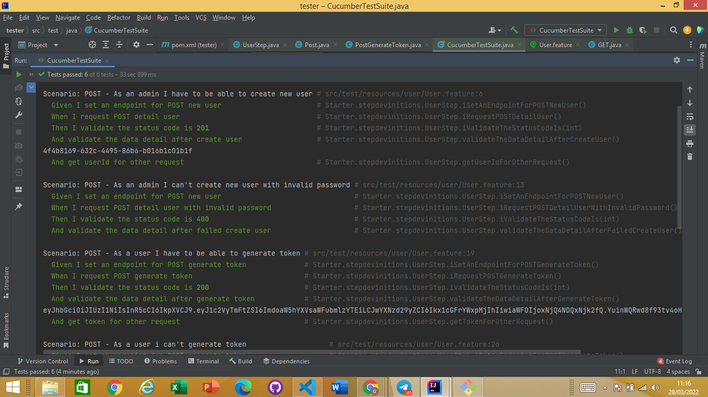
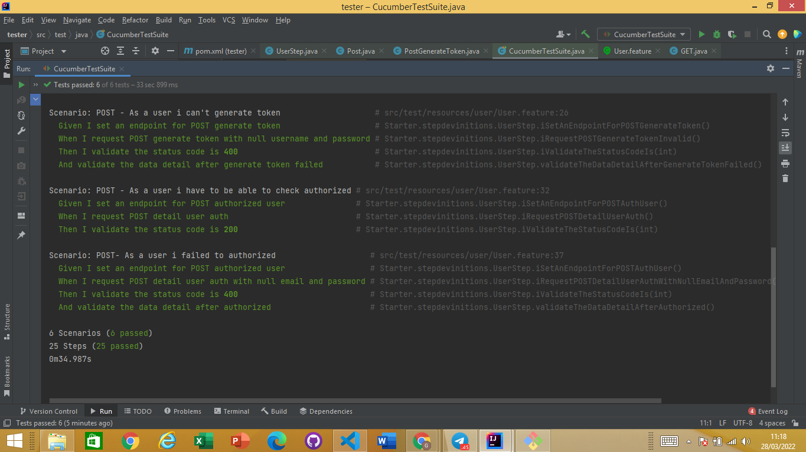
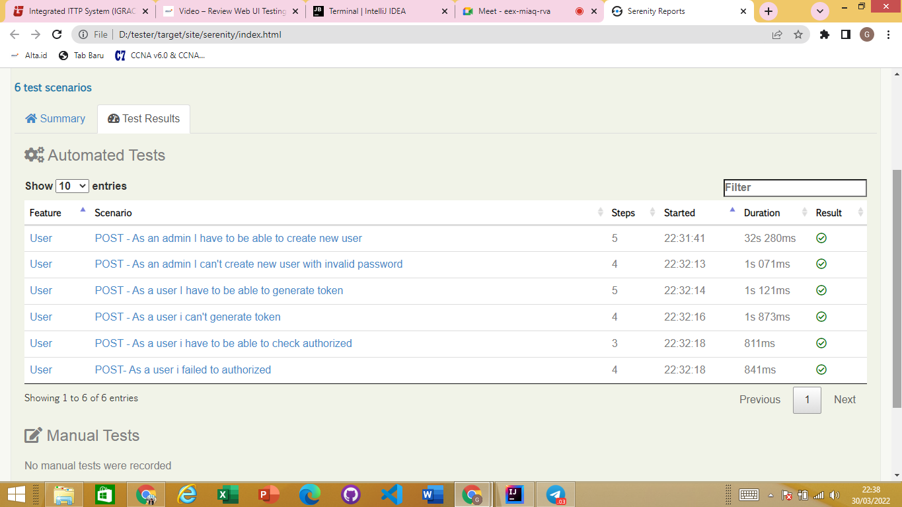

# RESTful API Testing With Rest Assured
  Materi yang akan di bahas : 
  1. API Concept

## RESTful API
  REST API (Representational State Transfer) merupakan standar arsitektur komunikasi berbasis web yang sering diterapkan dalam pengembangan layanan berbasis web. umumnya menggunakan HTTP (Hypertext Transfer Protocol) sebagai protocol untuk komunikasi data. REST juga merupakan salah satu implementasi dari web service sebagai tanda yang digunakan untuk pertukaran data antara aplikasi maupun sistem. 
  Rest API berisi aturan atau batasan yang dapat membatasi programmer untuk mengakses atau melakukan tindakan-tindakan tertentu pada sebuah database. Jika API adalah penghubung, maka REST yang membuat aturan sesuai keinginan programmer dalam merancang web service. simplenya, terdapat request dan response pada data yang dikirimkan ataupun yang diterima. Data yang digunakan dalam REST API umumnya berupa JSON.

## Fundamental API Test Process
   Test process dari sebuah API :
   1. Definisikan sebuah API yang akan ditest
   2. Input data yang dibutuhkan baik di header maupun di body requestnya
   3. Send Request ke server dan melakukan validasi terhadap respon yang diberikan 

## The Pratical Test Pyramid
   Terdapat beberapa kategori yang tiap bagiannya memiliki test dan nantinya akan memudahkan kita untuk test secara menyeluruh.
   1. Unit Test  
      merupakan pengujian perangkat lunak yang menguji setiap unit atau kompone dari sebuah perangkat lunak, unit testing dilakukan pada masa pengembangan atau pada saat menuliskan kode program dari sebuah perangkat lunak oleh developer. Seperti namanya, komponen yang diuji pada unit testing adalah unit-unit dari perangkat lunak. Unit disini dapat berupa function, method, procedure, module, maupun object. Tujuan dari unit testing adalah untuk memvalidasi setiap unit dari kode perangkat lunak dapat berjalan seperti yang diharapkan.
   2. Component Testing 
      component testing merupakan jenis pengujian perangkat lunak dimana pengujian dilakukan pada setiap komponen individu secara terpisah tanpa mengintegrasikan dengan komponen lain. Umumnya perangkat lunak apapun secara keseluruhan terbuat dari beberapa komponen, pengujian tingkat komponen berkaitan dengan pengujian komponen satu per satu. ini adalah salah satu jenis black box testing yang paling sering dilakukan tim QE.
   3. Integration Testing 
      merupakan pengujian dari hasil penggabungan unit unit yang ada di dalam software, biasanya QE menguji bagaimana unit unit tersebut bekerja sebagai kombinasi bukan lagi suatu unit yang individual. integration testing sebaiknya dilakukan secara bertahap untuk menghindari kesulitan penelusuran saat mencari bug pada test.
   4. UI Test (end to end test)
      merupakan yang paling dekat dengan interaksi pengguna pada aplikasi web. user input harus bisa memicu tindakan yang tepat data harus disajikan kepada pengguna status UI harus berubah seperti yang diarahkan. UI menggunakan tools atau framework, end to end test memberitahu browser apa yang harus dilakukan seperti klik, ketik serta expected result yang diharapkan memalui test tersebut.
   Melalui test piramida kita dapat dengan mudah mengetahui hal penting, seperti :
   1. Semakin tinggi level atau semakin tinggi tingkatannya semakin sedikit  test yang kita lakukan, karna semakin tinggi level untuk membuat test case menjalankan plan dan mudah maintenance yang  memerlukan biaya yang lebih mahal.
   2. Penulisan test tiap level berbeda dari tingkat detailnya

## BDD With Cucumber
   1. Write story
      Gherkin, Syntax (Given, when, than)
   2. Maps Step to Java
      Configure steps script and validation
   3. Configure Stories
      combine stories and steps 
   4. Run Stories 
      Intellij IDEA mave
   5. View Reports
      Make a report using serenity

## Rest Assured 
   1. Support for HTTP method
   2. Supports for BDD / Gherkin (Given, When, Then)
   3. Use of Hamcrest Matches for checks (equalTo)
   4. User of Gpath for selecting element from JSON response
      

# TASK
  1.    
  2. 
  3. 