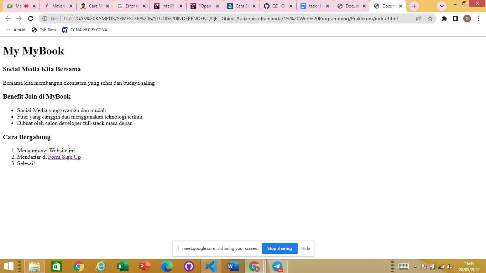
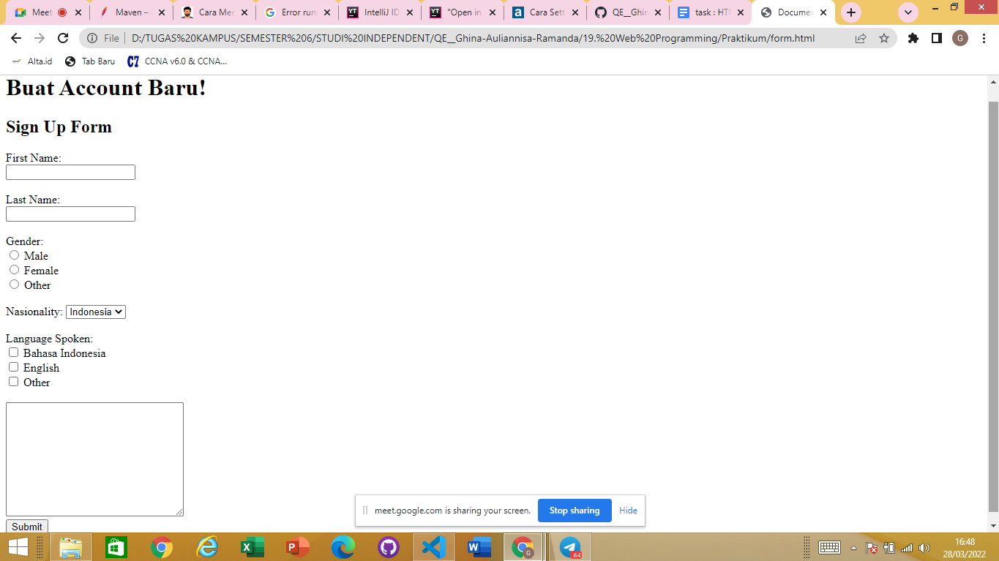
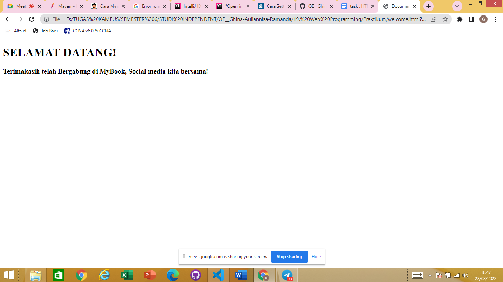

# WEB PROGRAMMING (FRONT-END DEVELOPMENT)
  Materi ini akan membahas : 
  1. HTML (HyperText Markup Language)
  2. CSS (Cascading Style Sheets)

## Proses Web Development
   Dalam proses ini dibagi menjadi 2 yaitu :
   1. Bakend
      merupakan bagian website yang tidak dapat berinteraksi langsung atau dilihat oleh user.
      contohnya yaitu data base
   2. Frontend
      merupakan bagian website yang membuat tampilannya menarik dan dilihat oleh user. frontend akan dibangun dari 3 komponen utama yang masing - masingnya memiliki fungsi dan perannya, yaitu :
      1. HTML (HyperText Markup Language)
         Berfungsi sebagai struktur yang akan membangun komponen website yang dibuat
      2. CSS (Cascading Style Sheets)
         Yang akan membuat tampilan website menjadi lebih menarik. 
      3. Java Script
         Yang akan membuat website menjadi lebih hidup dan interktif melalui fungsi - fungsi yang diberikan

## Apa itu HTML 
   HTML (HyperText Markup Language) merupakan sebuah standar yang digunakan secara luas untuk menampilkan halaman web. Manfaat utama struktur HTML yaitu :
   1. Membuat struktur dari halaman website
   2. Mengatur Tampilan dan isi dari halaman web
   3. Membuat tabel dengan tag HTML table
   4. Membuat form HTML
   5. Membuat gambar dengan canvas
   6. Mempublikasikan halaman website secara online

## Tools HTML
   1. HTML Editors / Teks Editor
      Akan berfungsi sebagai tempat untuk mengedit code HTML.
      Code HTML yang bisa digunakan yaitu :
      - Notepad
      - Visual Studio Code
      - Sublime Text
      - Notepad ++
      - Atom

## Dokumentasi HTML
   Syntax HTML :
   1.  <! DOCTYPE html>	Deklarasi untuk mendefinisikan dokumen menjadi HTML
   2.  <html>	Tag pembuka untuk membuat dokumen HTML
   3.  <head>	Informasi meta tentang dokumen
   4.  <title>	Membuat judul halaman yang nantinya akan ditampilkan di browser
   5.  <body>	Tempat dibuatnya semua konten website menggunakan HTML
   Tag Judul :
   1. <h1> s/d <h6>	 Membuat judul atau heading
   2. 
	Memisahkan konten (biasanya ditampilkan garis pembatas)
   Tag Paragraph :
   1. 
	 Membuat paragraf
   2.  	 Membuat garis baru
   3. <pre>	 Memfortmat teks atau kalimat
   Tag Style :
   1. <strong> membuat text lebih tebal </strong>
   2. <em> penekanan text menjadi italic </em>
   3. <s> membuat text dengan garis tercoret </s>
   4.   line break untuk membuat garis baru
   Tag Gambar :
   1.  Elemen untuk mendefinisikan gambar
   2. <picture>	Menampilkan gambar yang berbeda untuk perangkat yang berbeda

## CSS (Cascading Style Sheets)
   Dapat menghias halaman web (color, size, font, background, width, height, dll). dapat mengatur posisi pada halaman web (float, align, display, position, dll)

# TASK
  1. 
  2. 
  3. 