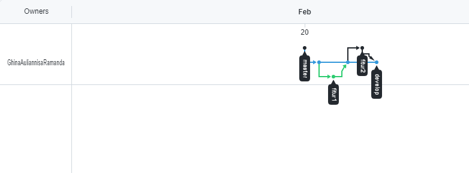

# Versioning Control With Git
Dalam materi ini, mempelajari tentang : 
1. Apa itu versioning?
2. Apa itu Git dan Github?
3. Tools
4. Pengoptimalan kolaborasi development

# Resume
# Apa itu versioning ?
Merupakan sebuah sistem yang merekam Perubahan - perubahan dari sebuah berkas atau sekumpulan berkas dari waktu ke waktu sehingga dapat melihat versi khusus nantinya.

# Tools
- Versioning Control System (VCS)
  1. Single User
  2. Centralized
  3. Distributed
- Source Code Manager (SCM)
- Revision Control System (RCS)

# Apa itu Git ?
Merupakan salah satu sistem pengontrol versi pada proyek perangkat lunak yang diciptakan linux thoughfall.
Commit merupakan catatan perubahan
Github merupakan git hosting service

# Pengoptimalan Kolaborasi Development
membuat beberapa branch agar kolaborasi dapat berjalan dengan baik
- Membuat branch master dari branch development
- Menghindari direct edit ke branch development
- Merge branch feature ke branch development
- Merge branch development ke branch master jika project selesai

# Task
Pada task ini membuat repository baru pada github dan membuat branch

