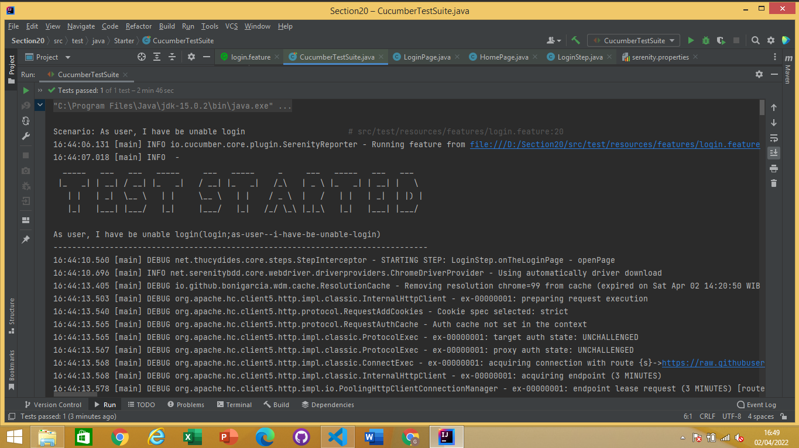
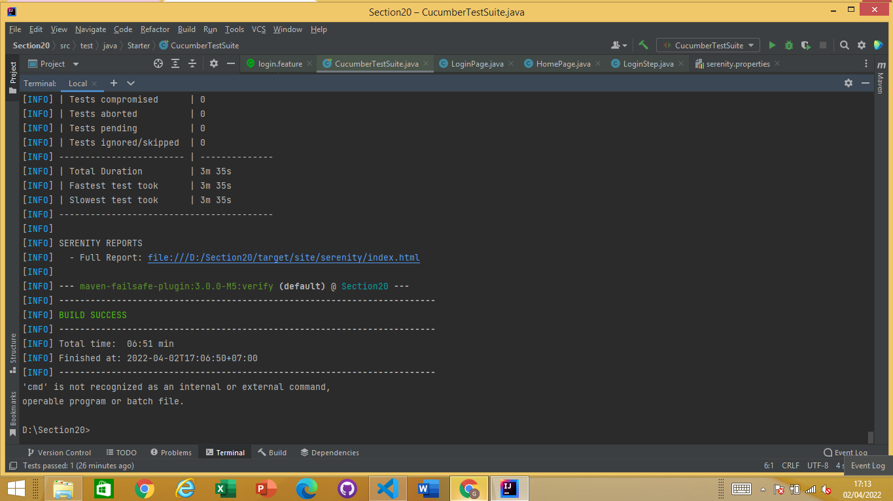
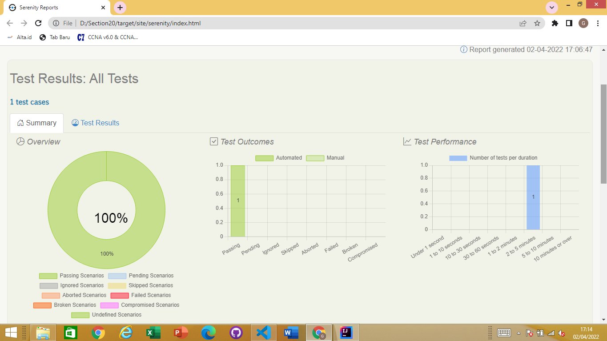
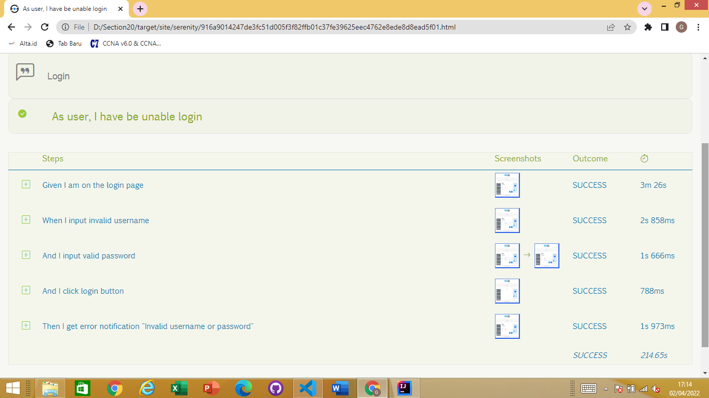

# REVIEW WEB UI TESTING WITH SERENITY
  materi yang akan dibahas yaitu :
  1. Introduction Serenity BDD
  2. BDD Framework With Cucumber

## Apa itu Web Automation Testing ?
   Merupakan suatu cara yang dilakukan untuk melakukan testing terhadap web yang dibuat. 
   ada beberapa tools yang digunakan :
   1. Katalon 
      Pada katalon kita bisa menangkap object/element (button, field text, datepicker, link, checkbox, radio button, select, ect. ) pada setiap page di web browser ataupun aplikasi mobile yang sedang kita record untuk dapat dijalankan pada testing. Namun jika ada terdapat error di saat melakukan play sesuai record yang telah kita buat, maka kita bisa melakukan penambahan script untuk melakukan pengecekan lebih lanjut.
   2. Cypress.io 
      free test tools dimana bisa di run pada Cl dan dapat digunakan pada operating systems seperti Mac, Linux, dan Windows. Saat ini Cypress hanya bisa melakukan pengerjaan testing pada web saja, jadi belum dapat melakukan pengerjaan pada native mobile app.
   3. Appium
      automation native untuk mobile web, dan hybrid aplikasi untuk platform iOS serta android. native apps penulisannya menggunakan iOS dan android SDKs. Appium bisa dijalankan baik pada simulator ataupun real devices dan tentunya open source (gratisan).

## Arsitektur Serenity BDD
   serenity bdd merupakan library open source yang membantu tester dalam menulis automation test yang terstruktur dan lebih terawat dengan baik dan menghasilkan laporan pengujian yang bermakna.
   Serenity BDD memiliki arsitektur sebagai berikut :
   1. Requirements
   2. Test
   3. Step
   4. Pages
   5. Reports

## Define Rewquirements
   - when using serenity you start with the requirements you need to implement.
   - These are often expressed as user stories with acceptance criteria that help clarify requirements
   - it is these stories that serenity automate

## Automate Acceptance Criteria
   - Next, describe the acceptance criteria in high-level business terms
   - record these acceptance criteria using either a BDD tool such as cucumber with the form feature so that serenity can run them

## Implement the test
   - Implement the acceptance criteria into a code, so that they can run against the actual application
   - under the hood, test are broken doewn into nested steps for better readability and easir maintenance

## Report on test result
  - Narative for each test
  - Screenshoots for each step in the test
  - Test result including execution times and error messages if a test failed

# TASK
  
  
  
  