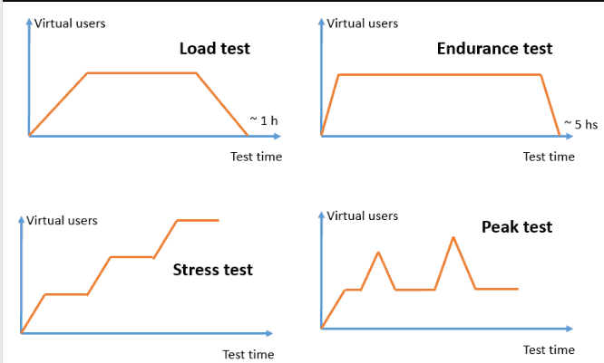
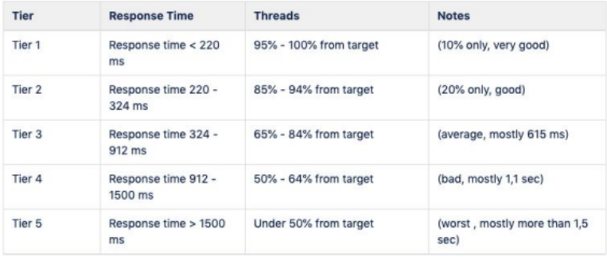
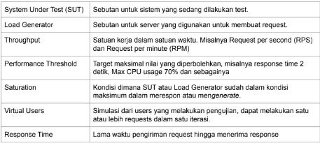
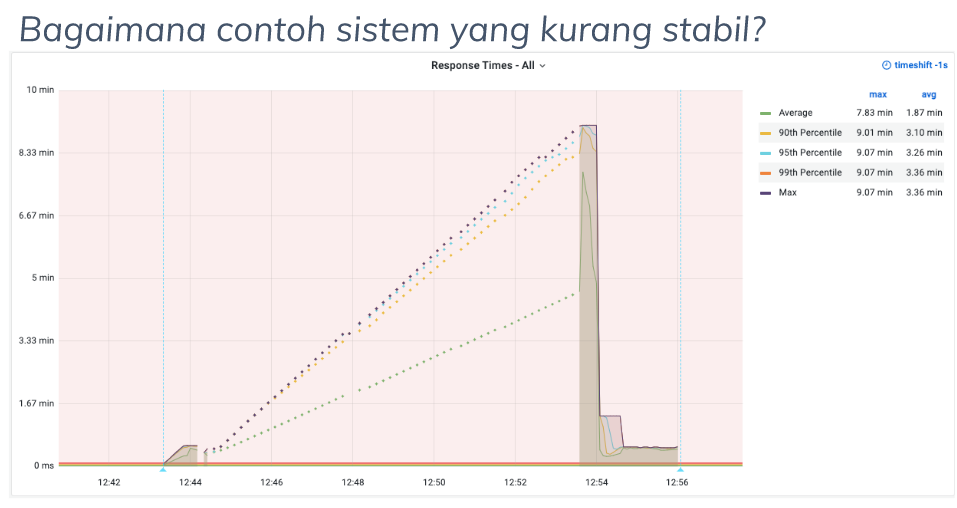

# FUNDAMENTAL PERFORANCE TEST
  Materi yang akan dibahas :
  1. Performance Test
  2. Introduction to Jmeter
  3. Post Processor

## Apa itu performance Test ?
   Merupakan teknik non functional testing untuk menentukan parameter sistem dalam hal responsif dan stabilitas dibawah berbagai beban (load) kerja.
   Performance testing mengukur kualitas atribut dari sistem seperti stabilitas, ketahanan (reliability) dan penggunaan sumber daya.

## Apa yang diukut dari performance test?
   1. Performa suatu aplikasi sampai suatu batas tertentu
   2. Bukan merupakan functional-test
   3. Bisa dalam berbagai macam bentuk untuk memahami reliability, stability dan avaibility pada environmentnya
   contoh :
   Mengamati response time ketika menjalankan request dalam jumlah yang sangat banyak, melihat suatu sistem berinteraksi dengan jumlah yang cukup besar

## Mengapa performance test jarang dilakukan?
   Pada umumnya performance testing cukup mahal untuk diaplikasikan dan dijalankan, namun dapat dijadikan tolak ukur apakah sistem tersebut dapat mengakomodasi traffic yang ada.
   hal ini disebabkan karena pengetesannya memerlukan persiapan dimana beberapa kasus harus membuat environment terpisah dari production agar tidak tercampurnya data test dengan data production.
   Environment ini ada juga yang membuatnya di sever cloud ynag biayanya bisa lebih besar dari environment production.

## Apa yang perlu diperhatikan dari performance test ?
   Yang perlu diperhatikan yaitu throughput dan response datanya, misal sistem yang sudah ditest mendapatkan hasil Nilai throughput dilihat dari request per seconds dan request per minute dan untuk response time diambil 95% percentile, nilai VUs juga menjadi perhatian karena untuk mengetahui banyaknya request dalam 1 iterasi.

## Contoh kasus performance test
   Sebuah sistem baru yang akan di launch ke production, namun sebelum masuk ke production perlu dilakukan performance test untuk mengetahui throughput dan response time dari sistem tersebut. untuk informasi endpoint yang akan ditest yaitu :
   1. /login
   2. /beli-pulsa
   3. /cek-out
   Langkah yang harus dilakukan :
   1. Membuat test plan
   2. membuat script test
   3. Melakukan performance test
   4. Menganalisa hasil performance test

## Membuat test plan
   Kenali yang dibutuhkan :
   1. Endpoint yang akan ditest :
      - /login
      - /beli-pulsa
      - /cek-out
   2. Kebutuhan masing - masing endpoint :
      - Username and password for endpoint /login
      - Produk, denom dan nomor untuk pengetesan endpoint /beli-pulsa
      - Metode pembayaran yang dipilih untuk endpoint /cekout

## Menentukan metode test
   - pilih berdasarkan kondisi sistem, apakah belum pernah dites atau sudah (selalu awali dengan load test untuk tahu kondisi awal sistem)
   - pilih berdasarkan situasi yang akan dihadapi

## Some types of performance test
   
   Gambar di atas menunjukkan cara untuk merepresentasikan beberapa pengujian kinerja ini dan seperti apa grafik pengguna virtual aktif selama waktu pengujian.
   1. Smoke Testing
      Dilakukan untuk virify script yang sudah dibuat, apakah sistem tersebut dapat di handlr minimal load, tanpa masalah sama sekali. biasanya hanya 1-2 VUs.
   2. Load Testing
      load testing merupakan pengujian yang paling sederhana yang dilakukan untuk memahami perilaku sistem dalam keadaan beban tertentu. hasil dari load test digunakan untuk mengukur kepentingan bisnis saat transaksi yang kritis dengan memonitor dampak terhadap database, application server atau pengukung lainnya.
      sederhananya load testing menentukan kelakukan sistem pada saat kondisi normal dan puncak. idealnya, kita mengetahui jumlah trafffic yang ada di prod sebagai nilai di load test.
   3. Tabel Tier
      Tabel tier bisa dijadian patokan ideal suatu sistem baru yang belum pernah masuk ke production.
      
   4. Stress Testing
      Metode ini dilakukan untuk mengamati kemampuan dan kestabilan sistem pada saat kondisi ekstream.
      dilakukan secara bertahap untuk menuju load normal, puncak dan melebihinya, lalu turun untuk melihat proses recovery.
   5. Spike Testing
      Sama seperti stress test namun kenaikan langsung menuju melebihi puncak dilakukan dalam waktu singkat. jika stress test memberikan waktu untuk scale out, pada spike testing tidak. 
      salah satu contoh adalah pada saat flash sale di suatu e-commerce yang dimana banyaknya kunjunga pengguna yang langsung memuncak saat mengakses halaman flash sale.
   6. Soak Testing
      Untuk mengetahui reliability ketika dalam tekanan dibawah puncak dalam jangkan panjang (>=1 jam). dapat mengetahui apakah terdapat bug pada race condition, memory leaks, db connection dsb.
      Tips : Metode ini bisa dilakukan pada jam - jam sepi tidak ada transaksi sistem jika test dilakukan di production.
   7. Endurance Test
      Test daya tahan server dalam jangka panjang untuk Memeriksa kebocoran memori atau masalah lainnya yang mungkin terjadi dengan eksekusi yang berkepanjangan.

## Istilah penting dalam performance test
   

## Answer to your question part 1
   1. Apa itu volume test? Apakah sama dengan load test ?
   Jawab : Volume test adalah salah satu nonfunctional test yang menguji ketahanan suatu sistem ketika diberi database yang banyak, dikenal juga dengan istilah flood test.
   Berbeda dengan load test yang menguji ketahanan secara umum, volume test berfokus pada sistem database saja.
   2. Bagaimana Contoh sistem yang kurang stabil ?
   Jawab : 
   

