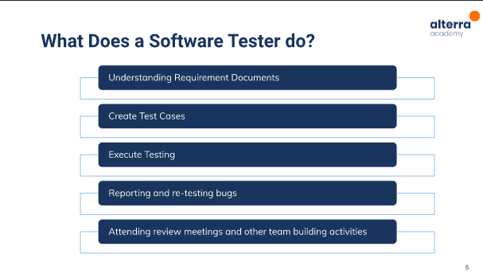
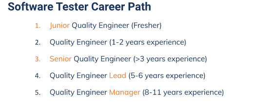
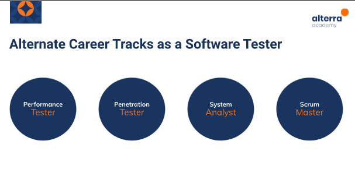
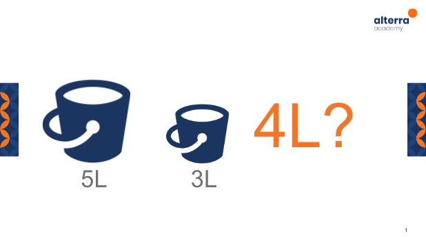

# Software Testing as a Career Path
Apa saja materi yang dibahas pada section ini :
1. Apa itu Software Testing?
2. Apa saja yang dilakukan Software tester?
3. Skill Apa saja yang dibutuhkan ?
4. Jenjang karir didunia testing 
5. Alternatif karir

# Apa itu Software Testing?
Software testing merupakan verifikasi sistem / program komputer untuk memutuskan apakah memenuhi persyaratan yang ditentukan dan mengeluarkan hasil yang diinginkan, sebagai hasilnya nanti kita akan mengidentifikasi apakah dalam satu product / proyek perangkat lunak terdapat bug atau tidak.

# Apa saja yang dilakukan Software tester?
Software tester juga dapat dibilang bagian penting dari sebuah tim dalam software development, mereka harus menguji sistem atau product secara menyeluruh untuk menemukan apakah ada cacat didalamnya atau tidak. Jika semuanya sudah tidak ada masalah, maka sistem atau product tsb bisa diluncurkan ke client atau ke konsumen. Namun, jika ada masalah bug atau error dalam coding dan semacamnya, maka pihak developer akan memperbaikinya terlebih dahulu, selanjutnya software tester akan kembali mengujinya, apakah masih ada kesalahan atau tidak.
   

# Skill Apa saja yang dibutuhkan ?
  1. Technical Skills 
     - Dasar - dasar linux
     - Test management tools
     - Tracking management tools (jira, pivotal tracker dsb)
     - Automation testing tools ()
      
  2. Non-Technical Skills 
     - Analitical skills : Agar dapat memudahkan kita untuk memecahkan tatanan software yang kompleks menjadi unit yang sederhana, sehingga dapat menemukan kesalahan dengan mudah.
     - Communication skills : dalam suatu pekerjaan akan berkomunikasi dengan tim product atau development
     - Time Management dan Organization skills
     - Great Attitude
     - Passion
# Jenjang karir didunia testing
  

# Alternatif karir
  

# TASK
Pada tugas kali ini Membuat 4 liter air dari ember 5 dan 3 liter

# Pertama 
Isi penuh ember 3L lalu tuangkan ke ember 5L, jadi yang ada di ember 3L kosong
# Kedua
Isi penuh kembali ember 3L, tuangkan ember yang 3L ke dalam ember 5L sampai penuh, jadi yang di ember 3L sisa 1L
# Ketiga
Pada ember 5L airnya dibuang lalu tuangkan air 1L yang ada di ember 3L, jadi ember yang di 3L kosong
# keempat
Lalu isi kembali ember 3L dengan air hingga penuh dan tuangkan ke dalam ember 5L yang sudah berisi air 1L, jadi pada ember 5L berisi air 4L
