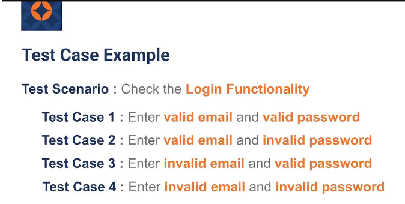
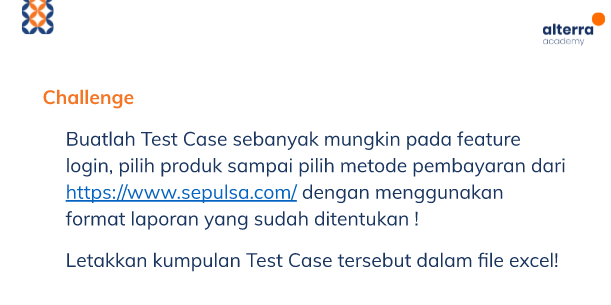

# TESTING DOCUMENTATION (Test Scenario – Test Case – dll)
Dalam materi ini mempelajari:
1. Apa itu Test Skenario ?
2. Apa itu Tes Case ?
3. Contohnya apa ?

## Test Skenario
Merupakan sebuah dokumen yang memberikan langkah - langkah sistematis yang disusun oleh software tester,agar sistem yang akan di test memenuhi ketentuan yang diinginkan oleh user. Test skenario merupakan tes tertinggi dari sebuah test case, Skenario Test memberikan gambaran tentang apa yang harus kita uji, Skenario Test seperti kasus uji tingkat tinggi
- Contoh tes skenario: Check login Functional

## Test Case
Test case atau biasa disebut uji kasus merupakan tindakan yang dilakukan oleh software tester untuk melakukan virifikasi pada fungsi fitur tertentu dari sebuah perangkat lunak. Didalame test case terdapat langkah-langkah yang akan dieksekusi, yaitu positif dan negatif dari Skenario Uji. Test Case memiliki syarat, langkah, hasil yang diharapkan, status, dan hasil aktual
- Contoh tes case: Enter valid email and valid password

## Contohnya 

# TASK

https://docs.google.com/spreadsheets/d/1mRpI_yPofeKMnwqfh3BD2k02-esFeTVE/edit?usp=sharing&ouid=113771883722166757829&rtpof=true&sd=true